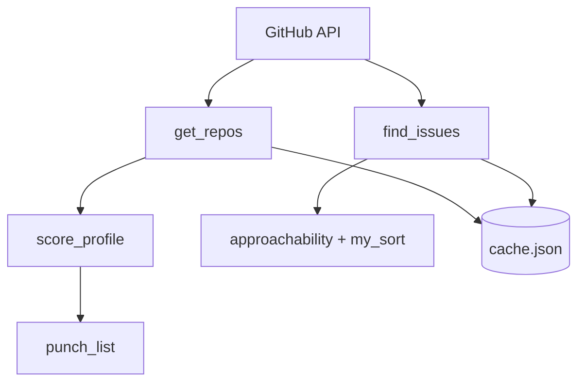

# 🎯 GitGauge

**GitHub Profile Auditor & Beginner Issue Finder**

GitGauge is a command-line tool that audits a GitHub profile, scores it against recruiter-relevant criteria, and helps you find beginner-friendly open-source issues to work on.

> **"Audit. Improve. Contribute."**

---

## 📑 Table of Contents

- [Overview](#overview)
- [Key Features](#-key-features)
- [How It Works](#-how-it-works)
- [Architecture](#-architecture)
- [Tech Stack](#️-tech-stack)
- [Getting Started](#-getting-started)
- [Usage](#-usage)
- [What's Next](#-whats-next)

---

## Overview

GitGauge answers two questions for a developer working on their portfolio:

1. **How does my GitHub profile look to a recruiter?**
2. **What should I fix, and what should I work on next?**

It fetches your public repos from the GitHub API, scores your profile out of 100, tells you the top 3 things to fix, and searches for open "good first issue" tickets in a language you choose — ranked by how approachable they look.

---

## 🔥 Key Features

| Feature | Description |
|---|---|
| 📊 Profile Scoring | Scores a GitHub profile out of 100 across weighted criteria |
| 🧾 Breakdown | Shows exactly where points were earned or lost |
| ✅ Punch List | Prints the top 3 highest-impact fixes, in plain language |
| 🔍 Issue Finder | Searches GitHub for open "good first issue" tickets by language |
| 🧮 Approachability Ranking | Ranks issues by comment count and age |
| 💾 Local Caching | Caches profile lookups to avoid repeat API calls |
| 🖥️ CLI Menu | Simple interactive menu — audit a profile or find issues |

---

## 🧠 How It Works

1. **Fetch** — pulls your public repos from the GitHub API
2. **Score** — evaluates bio presence, repo descriptions, recent activity, stars, and original vs. forked repos
3. **Advise** — ranks your weakest areas and prints the top 3 fixes
4. **Search** — finds open, beginner-labeled issues in a language you pick
5. **Rank** — scores each issue's approachability and sorts them
6. **Cache** — stores fetched results locally for faster repeat lookups

---

## 🏗 Architecture



---

## ⚙️ Tech Stack

- Python 3
- GitHub REST API

---

## 🚀 Getting Started

### Prerequisites

- Python 3.7+
- A [GitHub Personal Access Token](https://github.com/settings/tokens)

### Installation

```bash
git clone https://github.com/techwithamair/gitgauge-stage1.git
cd gitgauge-stage1
```

### Configuration

```bash
export GITHUB_TOKEN=your_token_here
```

---

## 💻 Usage

```bash
python3 main.py
```
GitGauge

Audit a profile
Find issues
Quit


- **Option 1** — enter a username, get a score out of 100 and a 3-item punch list
- **Option 2** — enter a language, get the top 10 approachable open issues with links

---

## 🗺 What's Next

Stage 2 adds cohort comparisons across multiple profiles, with rankings and charts.

---

<div align="center">

**GitGauge** — *Audit. Improve. Contribute.*

</div>
